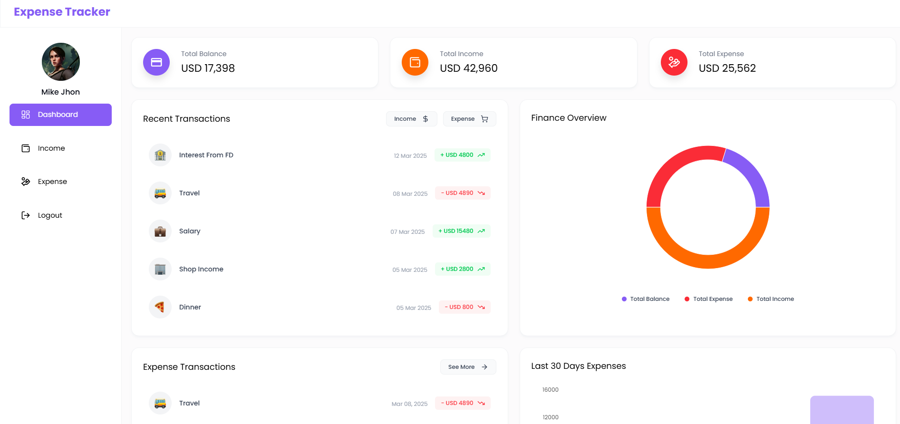

<div align="center">
  <br />
    <a href="#" target="_blank">
      
    </a>
  <br />

  <br />
  <div>
    
    
    
    
    
    
    
    
  </div>

  <h1 align="center">Expense Tracker - MERN</h1>

   <div align="center">
     This Expense Tracker is a full-stack web application built using the MERN (MongoDB, Express.js, React, Node.js) stack. It allows users to manage their finances by adding, editing, and deleting income and expense transactions. The application provides category-based filtering, interactive charts for expense visualization, and a responsive UI for seamless usage across different devices. It also includes user authentication with JWT for secure access. The project aims to help users track their spending habits efficiently with a user-friendly and visually appealing interface. 🚀
    </div>
</div>

## 📋 <a name="table">Table of Contents</a>

1. 🤖 [Introduction](#introduction)
2. ⚙️ [Tech Stack](#tech-stack)
3. 🔋 [Features](#features)
4. 📁 [Folder Structure](#folder-structure)
5. 🤸 [Quick Start](#quick-start)
6. 🕸️ [Code Snippets](#scode-nippets)
7. 🚀 [More](#more)

## <a name="introduction">🤖 Introduction</a>

This is a full-stack Expense Tracker application built using the MERN (MongoDB, Express.js, React, Node.js) stack. The app allows users to manage their expenses efficiently by adding, editing, and deleting transactions while providing insightful expense tracking features.

## <a name="tech-stack">⚙️ Tech Stack</a>

- Frontend: React + Vite, Redux, Tailwind CSS
- Backend: Node.js, Express.js
- Database: MongoDB with Mongoose
- Authentication: JWT (JSON Web Token)
- State Management: Redux Toolkit
- API Testing: Postman

## <a name="features">🔋 Features</a>

👉 User Authentication – Secure login and sign-up using JWT authentication.

👉 Dashboard Overview – Displays Total Balance, Income, and Expenses in summary cards.

👉 Income Management – Add, view, delete, and export income sources.

👉 Expense Management – Add, view, delete, and export expenses with category-based tracking.

👉 Interactive Charts – Visual representation of income & expenses using Bar, Pie, and Line charts.

👉 Recent Transactions – Displays the latest income and expense records for quick access.

👉 Expense & Income Reports – Download all income and expense data in Excel format.

👉 Mobile Responsive UI – Works seamlessly across desktops, tablets, and mobile devices.

👉 Intuitive Navigation – Sidebar menu with easy access to Dashboard, Income, Expenses, and Logout.

👉 Delete Functionality – Hover over income/expense cards to reveal a delete button for easy

## <a name="folder-structure">📁 Folder Structure</a>

```bash
Expense-Tracker-MERN/
├── backend/
│   ├── config              # Contains configuration files, including database connection settings
│   ├── controllers         # Holds functions that handle requests and responses for different API routes.
│   ├── middleware          # Includes middleware functions for authentication, error handling, and request validation.
│   ├── models              # Defines MongoDB schemas and models for storing expenses, users, and other data.
│   ├── routes              # Contains Express route definitions for handling API requests.
│   └── uploads             # Stores uploaded user files, such as profile pictures or receipts.
└── frontend/
    ├── public              # Contains static files such as the project preview image and favicons.
    └── src/
       ├── assets           # Holds images, icons, and other static assets used in the app.
       ├── components/      # Reusable UI components organized by functionality (e.g., Cards, Charts, Inputs).
       │   ├── Cards        # Contains components for visualizing expenses and income trends.
       │   ├── Charts       # Includes chart components for visualizing income and expense trends.
       │   ├── Common       # Holds commonly used UI components like Navbar, modals, and alerts.
       │   ├── Dashboard    # Contains components used on the main dashboard, such as statistics and overviews.
       │   ├── Expense      # Manages components related to expense transactions, including adding, listing, and filtering expenses.
       │   ├── Income       # Handles components for managing income transactions, similar to expenses.
       │   ├── Inputs       # Reusable input components designed to improve usability.
       │   └── Layouts      # Includes custom layout components for Auth and Dashboard to structure the UI.
       ├── context          # Manages global state using React Context API.
       ├── hooks            # Custom React hooks for reusing logic across components.
       ├── pages/           # Page components representing different views, like authentication and dashboard pages.
       │   ├── Auth         # Contains authentication-related pages, including login and registration.
       │   └── Dashboard    # Includes the main dashboard page where users can track their expenses and view analytics.
       └── utils            # Utility functions for formatting dates, numbers, and other reusable logic.
```

## <a name="quick-start">🤸 Quick Start</a>

Follow these steps to set up the project locally on your machine.

**Prerequisites**

Make sure you have the following installed on your machine:

- [Git](https://git-scm.com/)
- [Node.js](https://nodejs.org/en)
- [npm](https://www.npmjs.com/) (Node Package Manager)

**Cloning the Repository**

```bash
git clone https://github.com/MenathNDGD/Expense-Tracker-MERN.git
cd Expense-Tracker-MERN
```

**Installation**

**Create a .env file in the backend folder**

```bash
PORT=8000
MONGO_URI=YOUR_MONGO_URI
JWT_SECRET=tu8861sRFQyXDRH
```

**Setup Backend**

```bash
cd backend
npm run dev
```

**Setup Frontend**

```bash
cd frontend
npm run dev
```

Open [http://localhost:5174](http://localhost:5174) in your browser to view the project.

## <a name="code-snippets">🕸️ Code Snippets</a>

<details>
<summary><code>utils --> helper.js</code></summary>

```javascript
import moment from "moment";

export const validateEmail = (email) => {
  const regex = /^[^\s@]+@[^\s@]+\.[^\s@]+$/;
  return regex.test(email);
};

export const getInitials = (name) => {
  if (!name) return "";

  const words = name.split(" ");

  let initials = "";

  for (let i = 0; i < Math.min(words.length, 2); i++) {
    initials += words[i][0];
  }

  return initials.toUpperCase();
};

export const addThousandSeparator = (num) => {
  if (num == null || isNaN(num)) return "";

  const [integerPart, fractionalPart] = num.toString().split(".");

  const formattedInteger = integerPart.replace(/\B(?=(\d{3})+(?!\d))/g, ",");

  return fractionalPart
    ? `${formattedInteger}.${fractionalPart}`
    : formattedInteger;
};

export const prepareExpenseBarChartData = (data = []) => {
  const chartData = data.map((item) => ({
    category: item?.category,
    amount: item?.amount,
  }));

  return chartData;
};

export const prepareIncomeBarChartData = (data = []) => {
  const sortData = [...data].sort(
    (a, b) => new Date(a.date) - new Date(b.date)
  );

  const chartData = sortData.map((item) => ({
    month: moment(item?.date).format("MMM"),
    amount: item?.amount,
    source: item?.source,
  }));

  return chartData;
};

export const prepareExpenseLineChartData = (data = []) => {
  const sortData = [...data].sort(
    (a, b) => new Date(a.date) - new Date(b.date)
  );

  const chartData = sortData.map((item) => ({
    month: moment(item?.date).format("MMM"),
    amount: item?.amount,
    category: item?.category,
  }));

  return chartData;
};
```

</details>

<details>
<summary><code>utils --> apiPaths.js</code></summary>

```javascript
export const BASE_URL = "http://localhost:8000";

export const API_PATHS = {
  AUTH: {
    LOGIN: "/api/v1/auth/login",
    REGISTER: "/api/v1/auth/register",
    GET_USER_INFO: "/api/v1/auth/getUser",
  },
  DASHBOARD: {
    GET_DATA: "/api/v1/dashboard",
  },
  INCOME: {
    ADD_INCOME: "/api/v1/income/add",
    GET_ALL_INCOME: "/api/v1/income/get",
    DELETE_INCOME: (incomeId) => `/api/v1/income/${incomeId}`,
    DOWNLOAD_INCOME: "/api/v1/income/downloadExcel",
  },
  EXPENSE: {
    ADD_EXPENSE: "/api/v1/expense/add",
    GET_ALL_EXPENSE: "/api/v1/expense/get",
    DELETE_EXPENSE: (expenseId) => `/api/v1/expense/${expenseId}`,
    DOWNLOAD_EXPENSE: "/api/v1/expense/downloadExcel",
  },
  IMAGE: {
    UPLOAD_IMAGE: "/api/v1/auth/upload-image",
  },
};
```

</details>

<details>
<summary><code>utils --> data.js</code></summary>

```javascript
import {
  LuLayoutDashboard,
  LuHandCoins,
  LuWalletMinimal,
  LuLogOut,
} from "react-icons/lu";

export const SIDE_MENU_DATA = [
  {
    id: "01",
    label: "Dashboard",
    icon: LuLayoutDashboard,
    path: "/dashboard",
  },
  {
    id: "02",
    label: "Income",
    icon: LuWalletMinimal,
    path: "/income",
  },
  {
    id: "03",
    label: "Expense",
    icon: LuHandCoins,
    path: "/expense",
  },
  {
    id: "06",
    label: "Logout",
    icon: LuLogOut,
    path: "logout",
  },
];
```

</details>

## <a name="more">🚀 More</a>

**Feel free to tailor these contents according to your specific preferences or any additional details you want to include!**

- **Contributions:** Contributions are welcome! Feel free to fork the repository, make changes, and submit a pull request.

- **Feedback:** If you have any feedback or suggestions, I would love to hear from you. Reach out via the contact form on the portfolio or open an issue on GitHub.
